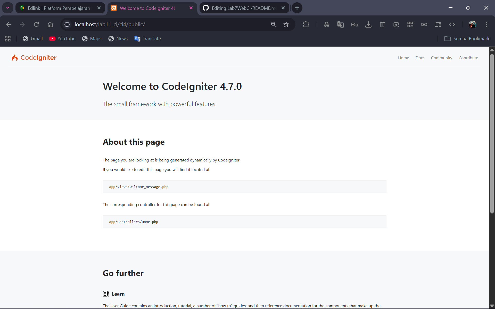
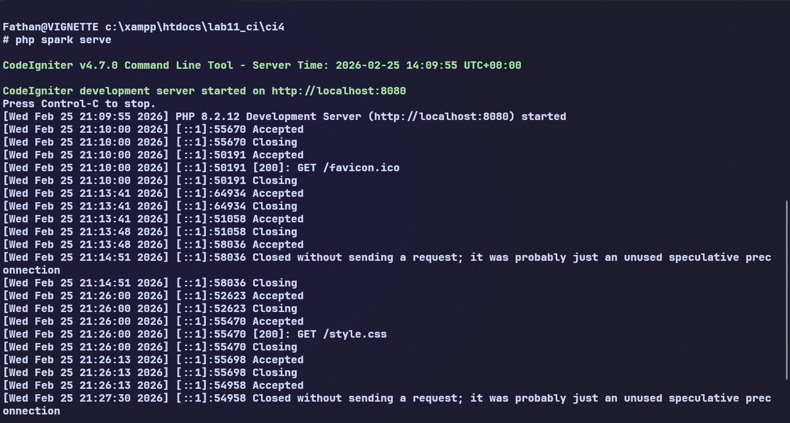
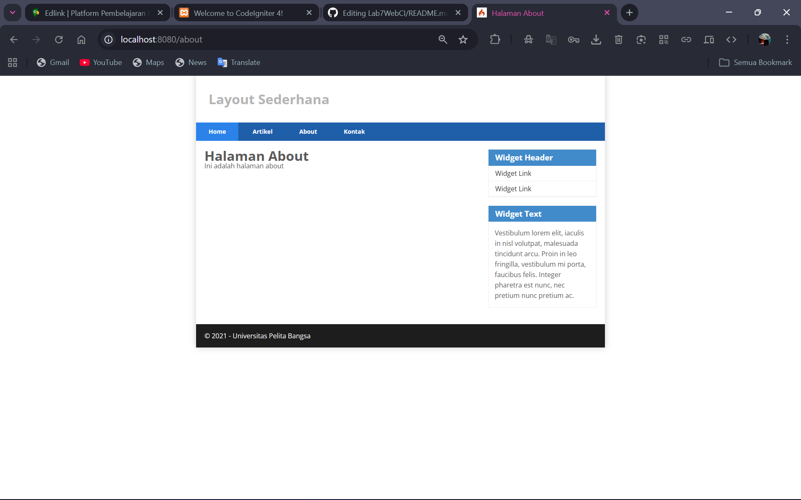
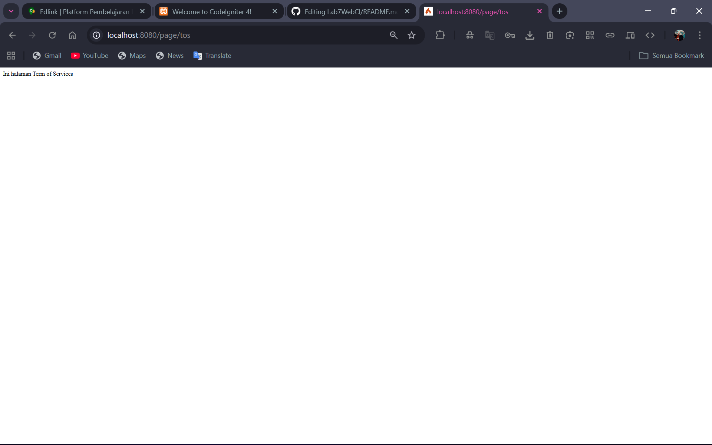
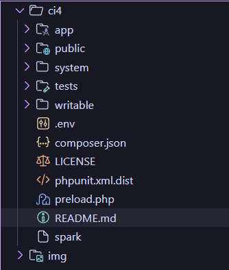
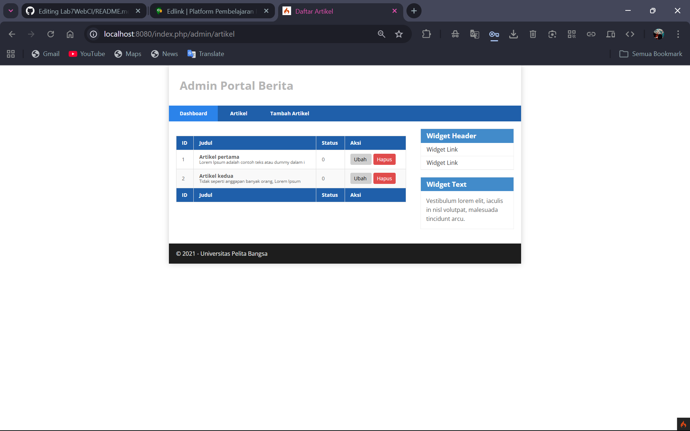
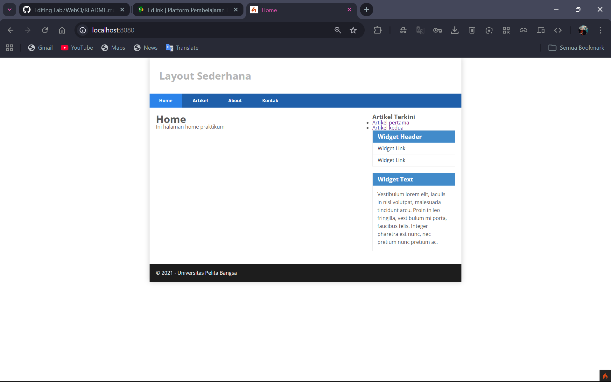
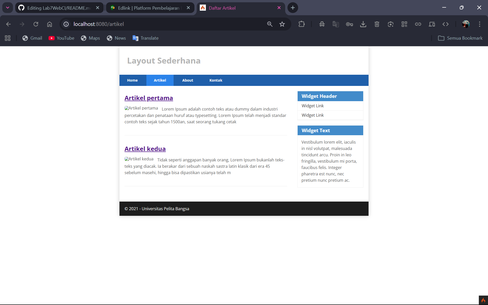

# 🚀 Praktikum Pemrograman Web 2  
## 🌐 CodeIgniter 4 – Routing & Auto Routing

<p align="center">
  
  
  
  
</p>

---

## 👤 Identitas Mahasiswa
| Keterangan | Isi |
|-----------|-----|
| Nama | Fathan Atallah Rasya Nugraha |
| NIM | 312410425 |
| Kelas | I241C |
| Mata Kuliah | Pemrograman Web 2 |

---
# 👟 Praktikum 1: PHP Framework (CodeIgniter)
## 📌 Deskripsi Praktikum
Praktikum ini bertujuan untuk memahami penggunaan dasar **Framework CodeIgniter 4**, meliputi proses instalasi, konfigurasi environment, pembuatan routing manual, penerapan auto routing, serta pengujian controller melalui browser.

---

## 🛠️ Tools & Software
- XAMPP  
- PHP 8.x  
- CodeIgniter 4  
- Visual Studio Code  
- Web Browser  
- Git & GitHub  

---

## ⚙️ Langkah-Langkah Praktikum

### 1️⃣ Instalasi CodeIgniter 4
1. Mengunduh CodeIgniter 4 dari situs resmi.  
2. Mengekstrak file ke folder:
   `htdocs/lab11_ci/ci4`
3. Menjalankan melalui browser: `http://localhost/lab11_ci/ci4/public`
Jika berhasil, akan muncul halaman **Welcome to CodeIgniter 4**.



---

### 2️⃣ Menjalankan Server CodeIgniter
Server dijalankan menggunakan perintah:
```bash
php spark serve
```

Server aktif pada alamat: `http://localhost:8080`



### 3️⃣ Konfigurasi Environment
Mengubah nama file env menjadi .env

Mengatur environment menjadi development:
```bash
CI_ENVIRONMENT = development
```

```bash
#--------------------------------------------------------------------
# Example Environment Configuration file
#
# This file can be used as a starting point for your own
# custom .env files, and contains most of the possible settings
# available in a default install.
#
# By default, all of the settings are commented out. If you want
# to override the setting, you must un-comment it by removing the '#'
# at the beginning of the line.
#--------------------------------------------------------------------

#--------------------------------------------------------------------
# ENVIRONMENT
#--------------------------------------------------------------------

# CI_ENVIRONMENT = development

#--------------------------------------------------------------------
# APP
#--------------------------------------------------------------------

# app.baseURL = ''
# If you have trouble with `.`, you could also use `_`.
# app_baseURL = ''
# app.forceGlobalSecureRequests = false
# app.CSPEnabled = false

#--------------------------------------------------------------------
# DATABASE
#--------------------------------------------------------------------

# database.default.hostname = localhost
# database.default.database = ci4
# database.default.username = root
# database.default.password = root
# database.default.DBDriver = MySQLi
# database.default.DBPrefix =
# database.default.port = 3306

# If you use MySQLi as tests, first update the values of Config\Database::$tests.
# database.tests.hostname = localhost
# database.tests.database = ci4_test
# database.tests.username = root
# database.tests.password = root
# database.tests.DBDriver = MySQLi
# database.tests.DBPrefix =
# database.tests.charset = utf8mb4
# database.tests.DBCollat = utf8mb4_general_ci
# database.tests.port = 3306

#--------------------------------------------------------------------
# ENCRYPTION
#--------------------------------------------------------------------

# encryption.key =

#--------------------------------------------------------------------
# SESSION
#--------------------------------------------------------------------

# session.driver = 'CodeIgniter\Session\Handlers\FileHandler'
# session.savePath = null

#--------------------------------------------------------------------
# LOGGER
#--------------------------------------------------------------------

# logger.threshold = 4
```

### 4️⃣ Routing Manual
Konfigurasi routing manual dilakukan pada file app/Config/Routes.php:
```php
<?php

use CodeIgniter\Router\RouteCollection;

/**
 * @var RouteCollection $routes
 */

$routes->setAutoRoute(true);

$routes->get('/', 'Home::index');
$routes->get('/about', 'Page::about');
$routes->get('/contact', 'Page::contact');
$routes->get('/faqs', 'Page::faqs');
```


### 5️⃣ Membuat Controller
Controller dibuat pada file `app/Controllers/Page.php`:
```php
<?php
namespace App\Controllers;

use App\Controllers\BaseController;

class Page extends BaseController
{
    public function about()
    {
        return view('about', [
            'title' => 'Halaman About',
            'content' => 'Ini adalah halaman about'
        ]);
    }

    public function contact()
    {
        echo "Ini halaman Contact";
    }

    public function faqs()
    {
        echo "Ini halaman FAQ";
    }

    public function tos()
    {
        echo "Ini halaman Term of Services";
    }
}
```

### 6️⃣ Mengaktifkan Auto Routing
Auto Routing diaktifkan dengan menambahkan konfigurasi berikut pada Routes.php:
```php
$routes->setAutoRoute(true);
```

Pada CodeIgniter 4 versi terbaru, perlu menonaktifkan Improved Auto Routing melalui file:
```php
app/Config/Feature.php
```
```php
public bool $autoRoutesImproved = false;
```

### 7️⃣ Pengujian Auto Routing
Pengujian dilakukan dengan mengakses URL:
`http://localhost:8080/page/tos`
Jika berhasil, akan tampil:
```bash
Ini halaman Term of Services
```


### 📂 Struktur Direktori Project


### ❗ Kendala yang Dihadapi
Auto Routing menampilkan error 404 pada CodeIgniter 4 versi terbaru.

#### ✅ Solusi
Menonaktifkan fitur Improved Auto Routing pada file Feature.php agar Auto Routing lama dapat digunakan sesuai modul praktikum.

### 📊 Hasil Praktikum
- Routing manual berhasil dijalankan
- Auto Routing berhasil digunakan
- Controller dapat diakses melalui browser
- Tidak ditemukan error setelah konfigurasi diperbaiki

### ✅ Kesimpulan
Dari praktikum ini dapat disimpulkan bahwa CodeIgniter 4 menyediakan fitur routing manual dan auto routing. Auto Routing mempermudah pemanggilan method controller, namun pada versi terbaru diperlukan konfigurasi tambahan agar sesuai dengan modul praktikum.


---

# 🗃️ Praktikum 2: Framework Lanjutan (CRUD)

## 📌 Deskripsi

Praktikum ini bertujuan untuk memahami konsep **CRUD (Create, Read, Update, Delete)** menggunakan CodeIgniter 4 dengan studi kasus data artikel.

---

## 🛠️ Langkah-Langkah Praktikum

### 1️⃣ Membuat Database

Membuat database dan tabel `artikel`:

```sql
CREATE DATABASE lab_ci4;

CREATE TABLE artikel (
 id INT(11) auto_increment,
 judul VARCHAR(200) NOT NULL,
 isi TEXT,
 gambar VARCHAR(200),
 status TINYINT(1) DEFAULT 0,
 slug VARCHAR(200),
 PRIMARY KEY(id)
);
```

---

### 2️⃣ Konfigurasi Database

Mengatur koneksi database pada file `.env`:

```bash
database.default.hostname = localhost
database.default.database = lab_ci4
database.default.username = root
database.default.password =
database.default.DBDriver = MySQLi
```

---

### 3️⃣ Membuat Model

File: `app/Models/ArtikelModel.php`

Model digunakan untuk mengelola data artikel dari database.

---

### 4️⃣ Membuat Controller

File: `app/Controllers/Artikel.php`

Controller digunakan untuk:

* Menampilkan data artikel
* Menambahkan artikel
* Mengedit artikel
* Menghapus artikel

---

### 5️⃣ Membuat View

View digunakan untuk menampilkan:

* Daftar artikel
* Detail artikel
* Halaman admin

---

## 📸 Hasil Praktikum

### 🔹 Daftar Artikel


### 🔹 Detail Artikel


### 🔹 Halaman Admin



### 🔹 Tambah Artikel


---

## 📊 Hasil

* Data artikel berhasil ditampilkan
* CRUD berjalan dengan baik
* Halaman admin dapat digunakan untuk mengelola data

---

## ✅ Kesimpulan

CRUD merupakan konsep dasar dalam pengolahan data. Dengan CodeIgniter 4, proses CRUD menjadi lebih terstruktur menggunakan Model, View, dan Controller.

---

# 🎨 Praktikum 3: View Layout & View Cell

## 📌 Deskripsi

Praktikum ini bertujuan untuk membuat tampilan web lebih terstruktur menggunakan **Layout Template** dan **View Cell**.

---

## 🛠️ Langkah-Langkah Praktikum

### 1️⃣ Membuat Layout Utama

Membuat file:

```
app/Views/layout/main.php
```

Layout berisi:

* Header
* Navbar
* Footer
* Section content

---

### 2️⃣ Menggunakan Layout

Pada file view:

```php
<?= $this->extend('layout/main') ?>
<?= $this->section('content') ?>
```

---

### 3️⃣ Membuat View Cell

Membuat komponen:

```
app/Cells/ArtikelTerkini.php
```

Digunakan untuk menampilkan artikel terbaru pada sidebar.

---

### 4️⃣ Menampilkan View Cell

Pada layout:

```php
<?= view_cell('App\\Cells\\ArtikelTerkini::render') ?>
```

---

## 📸 Hasil Praktikum

### 🔹 Tampilan Layout



### 🔹 Sidebar Artikel Terkini



---

## 📊 Hasil

* Tampilan website menjadi lebih rapi
* Layout dapat digunakan ulang
* Sidebar menampilkan data dinamis

---

## ✅ Kesimpulan

View Layout dan View Cell mempermudah pembuatan tampilan yang modular dan reusable dalam pengembangan aplikasi web.

---

# 🔐 Praktikum 4: Modul Login

## 📌 Deskripsi

Praktikum ini bertujuan untuk membuat sistem **Login (Authentication)** menggunakan CodeIgniter 4 dengan fitur session dan filter.

---

## 🛠️ Langkah-Langkah Praktikum

### 1️⃣ Membuat Tabel User

```sql
CREATE TABLE user (
 id INT(11) auto_increment,
 username VARCHAR(200) NOT NULL,
 useremail VARCHAR(200),
 userpassword VARCHAR(200),
 PRIMARY KEY(id)
);
```

---

### 2️⃣ Membuat Model User

File:

```
app/Models/UserModel.php
```

---

### 3️⃣ Membuat Controller Login

Controller `User.php` digunakan untuk:

* Proses login
* Validasi user
* Set session

---

### 4️⃣ Membuat View Login

File:

```
app/Views/user/login.php
```

Menampilkan form:

* Email
* Password

---

### 5️⃣ Membuat Seeder

Digunakan untuk membuat akun login:

* Email: [admin@email.com](mailto:admin@email.com)
* Password: admin123

---

### 6️⃣ Membuat Auth Filter

File:

```
app/Filters/Auth.php
```

Digunakan untuk:

* Membatasi akses halaman admin
* Redirect ke login jika belum login

---

### 7️⃣ Menambahkan Logout

```php
public function logout()
{
    session()->destroy();
    return redirect()->to('/user/login');
}
```

---

## 📸 Hasil Praktikum

### 🔹 Halaman Login


### 🔹 Login Berhasil


### 🔹 Halaman Admin (Setelah Login)


---

## 📊 Hasil

* Sistem login berhasil dibuat
* Session berjalan dengan baik
* Halaman admin terlindungi

---

## ✅ Kesimpulan

Sistem login merupakan bagian penting dalam aplikasi web. Dengan CodeIgniter 4, implementasi authentication dapat dilakukan dengan mudah menggunakan session dan filter.

---

# 🏁 Kesimpulan Akhir

Dari seluruh praktikum (1–4), telah berhasil dibuat sebuah aplikasi web sederhana berbasis CodeIgniter 4 yang mencakup:

* Routing & Controller
* CRUD Data
* Layout Template
* Sistem Login (Authentication)

Aplikasi ini sudah mencerminkan dasar pengembangan web modern menggunakan framework MVC.
